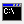

Gabe's Kernel Development Tutorial: The Keyboard

What's Left
-----------

What you do next to your kernel is completely up to you. The next thing you should
think of writing is a memory manager. A memory manager will allow you to grab
chunks of memory so that you can dynamically allocate and free memory as you need
it. Using a memory manager, you can use more complicated data structures such as
linked lists and binary trees to allow for more efficient storage and manipulation
of data. It's also a way of preventing applications from writing to kernel pages,
which is a feature of protection.

It's possible to write a VGA driver, also. Using a VGA driver, you can set up
different graphics modes in your kernel, allowing higher resolutions and graphical
display options such as buttons and images. If you want to go further, you could
eventually look into VESA video modes for high color and higher resolutions.

You could eventually write a device interface which would allow you to load or
unload kernel 'modules' as you need them. Add support for filesystems and disk
drives so that you can access files off disks and open applications.

It's very possible that you add multitasking support and design scheduling algorithms
to give certain tasks higher priority and longer time to run according to what the
application is designed to run at. The multitasking system closely relies on your
memory manager to give each task a separate space in memory.

### Example kernel online source tree

[start.s](../Sources/start.s)  
[gdt.c](../Sources/gdt.c)  
[idt.c](../Sources/idt.c)  
[irq.c](../Sources/irq.c)  
[isrs.c](../Sources/isrs.c)  
[kb.c](../Sources/kb.c)  
[main.c](../Sources/main.c)  
[scrn.c](../Sources/scrn.c)  
[timer.c](../Sources/timer.c)  
[include/system.h](../Sources/include/system.h)  
[link.ld](../Sources/link.ld)  
[build.bat](../Sources/build.bat)  
[build.sh](../Sources/build.sh)  
[dev\_kernel\_grub.img](../Sources/dev_kernel_grub.img)

Get the whole tutorial and example kernel [here]([../bkerndev.zip](https://github.com/gjbauer/gkerndev/archive/refs/heads/main.zip)) (110KBytes).

I hope that this tutorial has given you a more thorough understanding of some of the
various low-level items involved in creating a kernel: a driver for your processor
and memory.

